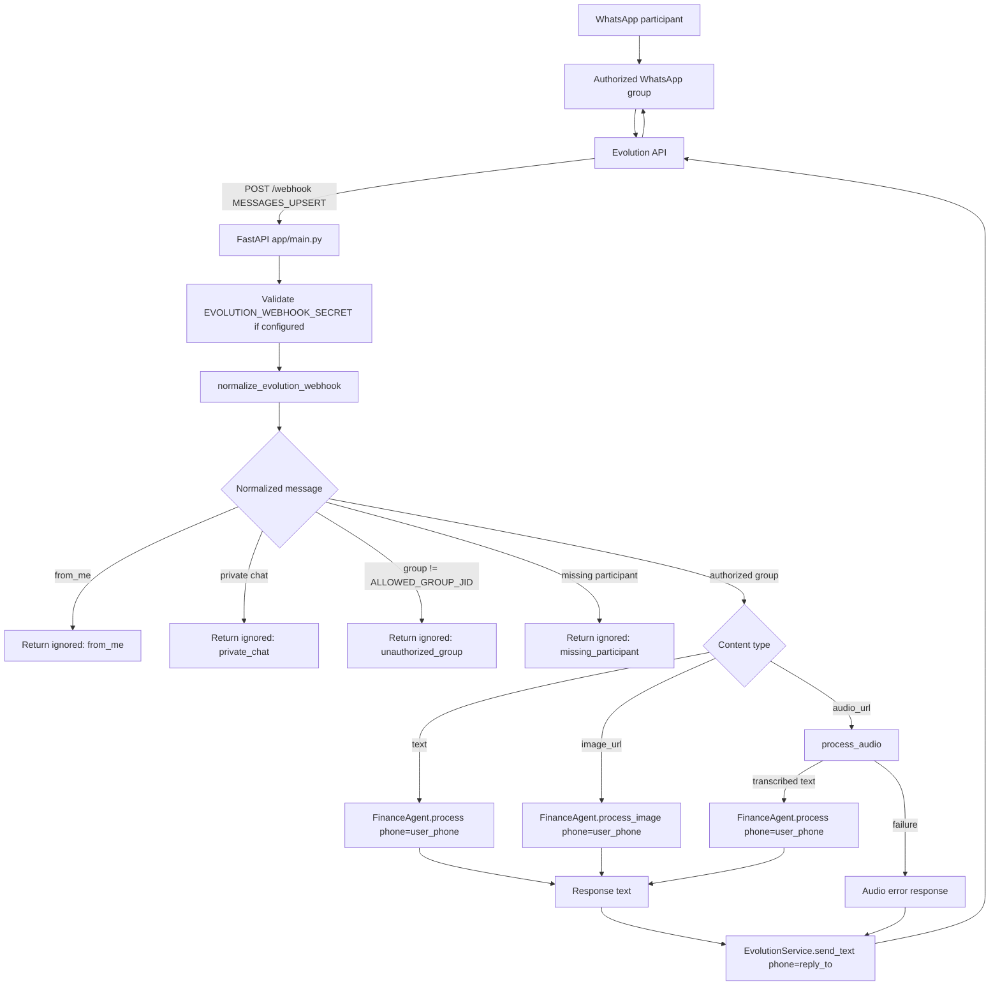

# Technical Design: Financas separadas em grupo WhatsApp autorizado

## Architectural Overview

The implementation will keep the existing FastAPI webhook, Evolution API adapter, `FinanceAgent`, LangGraph nodes, and SQLAlchemy models. The design changes the boundary between inbound WhatsApp identity and financial user identity.

Today `NormalizedWebhookMessage.phone` is used for both:

- the financial user key passed to `FinanceAgent`;
- the WhatsApp destination passed to `EvolutionService.send_text`.

For group messages these are different values. The group JID is the response destination, while the participant JID identifies the user whose finances should be read or written. The selected approach is to expand the webhook normalizer contract and update `app/main.py` to route using two explicit fields:

- `user_phone`: normalized participant phone used by `FinanceAgent`;
- `reply_to`: chat JID used by `EvolutionService`.

No database schema change is required. The current `users.phone` and `transactions.phone` columns already represent the financial user key. The implementation will keep that meaning and ensure those columns receive the participant phone, never the group JID.

This keeps the change conservative:

- provider-specific group payload parsing remains isolated in `app/services/webhook_normalizer.py`;
- business logic in `FinanceAgent`, `AgentState`, `nodes.py`, and database helpers continues to receive a `phone`;
- outbound sending continues through `EvolutionService.send_text`;
- private chat support is intentionally disabled for this feature by authorization logic in the webhook.

## Data Flow Diagram



## Component & Interface Definitions

### `app/services/webhook_normalizer.py`

The normalizer will expose a richer internal dataclass while keeping backward compatibility where practical. Existing tests that assert `phone` may be migrated to assert `user_phone`, or `phone` may remain as a compatibility alias for `user_phone` during this change.

```python
@dataclass(frozen=True)
class NormalizedWebhookMessage:
    phone: str | None
    chat_jid: str | None
    participant_jid: str | None
    user_phone: str | None
    reply_to: str | None
    is_group: bool
    from_me: bool
    text: str | None
    image_url: str | None
    image_caption: str | None
    audio_url: str | None
    raw_event: str | None
    ignored: bool
    ignore_reason: str | None = None
```

Field semantics:

- `chat_jid`: raw chat JID from `remoteJid`; group JIDs keep `@g.us`.
- `participant_jid`: sender participant JID for group messages.
- `user_phone`: normalized financial user phone. For groups this is derived from `participant_jid`.
- `phone`: compatibility alias for `user_phone`.
- `reply_to`: destination for replies. For groups this is the group `chat_jid`.
- `is_group`: `True` when `chat_jid.endswith("@g.us")`.
- `from_me`: parsed from Evolution payload fields.

Helper functions:

```python
GROUP_JID_SUFFIX = "@g.us"
USER_JID_SUFFIXES = ("@s.whatsapp.net", "@c.us")

def normalize_whatsapp_phone(value: str | None) -> str | None:
    ...

def is_group_jid(value: str | None) -> bool:
    ...

def normalize_evolution_webhook(payload: dict[str, Any]) -> NormalizedWebhookMessage:
    ...
```

Parsing rules:

- Event candidates: `event`, `type`, `data.event`.
- `from_me` candidates: `fromMe`, `key.fromMe`, `data.fromMe`, `data.key.fromMe`.
- `chat_jid` candidates: `data.key.remoteJid`, `key.remoteJid`, `data.remoteJid`, `remoteJid`.
- `participant_jid` candidates for groups: `data.key.participant`, `key.participant`, `data.participant`, `participant`, `data.sender`, `sender`.
- Text candidates: existing `conversation` and `extendedTextMessage.text` paths.
- Image and audio URL/caption candidates: existing paths in the current normalizer.

Ignored results should include these reasons:

- `unsupported_event`
- `from_me`
- `missing_chat_jid`
- `missing_participant`
- `missing_user_phone`
- `missing_content`

The normalizer should not make environment-based authorization decisions. It only parses payload shape and content. Authorization belongs in `app/main.py`.

### `app/main.py`

Add module-level config:

```python
ALLOWED_GROUP_JID = os.getenv("ALLOWED_GROUP_JID", "").strip()
```

Add a small authorization helper:

```python
def should_process_message(normalized: NormalizedWebhookMessage) -> tuple[bool, str | None]:
    if normalized.ignored:
        return False, normalized.ignore_reason
    if not normalized.is_group:
        return False, "private_chat"
    if not ALLOWED_GROUP_JID:
        return False, "missing_allowed_group_jid"
    if normalized.chat_jid != ALLOWED_GROUP_JID:
        return False, "unauthorized_group"
    if not normalized.user_phone:
        return False, "missing_user_phone"
    if not normalized.reply_to:
        return False, "missing_reply_to"
    return True, None
```

Webhook processing will use explicit local variables:

```python
user_phone = normalized.user_phone
reply_to = normalized.reply_to
```

Branch behavior:

- Text: `await agent.process(phone=user_phone, message=normalized.text)`.
- Image: `await agent.process_image(phone=user_phone, image_url=normalized.image_url, caption=normalized.image_caption or "")`.
- Audio: transcribe `normalized.audio_url`, then `await agent.process(phone=user_phone, message=transcribed_text)`.
- Audio transcription failure: `await whatsapp.send_text(phone=reply_to, message=<current friendly error>)`.
- Final response: `await whatsapp.send_text(phone=reply_to, message=response)`.
- Exception fallback: if `reply_to` is known, send the existing instability message to `reply_to`.

Logging should include structural metadata only:

```text
event=<event> ignored=<bool> reason=<reason> is_group=<bool> chat_jid=<masked> participant_present=<bool>
```

The log should not include full message text, media URLs, API keys, webhook secrets, or raw payloads by default.

### `app/services/evolution.py`

The outbound normalizer must preserve group JIDs.

```python
def _normalize_phone(phone: str | None) -> str:
    if not phone:
        return ""

    normalized = str(phone).strip()
    if normalized.endswith("@g.us"):
        return normalized

    for suffix in ("@s.whatsapp.net", "@c.us"):
        if suffix in normalized:
            return normalized.split(suffix, 1)[0]

    return normalized
```

`send_text(phone, message)` keeps the same public signature to avoid touching callers outside `app/main.py`. The parameter name remains `phone` for compatibility, but the design treats it as a WhatsApp send destination.

### `FinanceAgent`, `AgentState`, and database services

No interface change is planned.

```python
await agent.process(phone=user_phone, message=text)
await agent.process_image(phone=user_phone, image_url=image_url, caption=caption)
```

The current database functions already filter by `phone`:

- `get_user(phone)`
- `create_user(phone)`
- `save_transaction(phone, ...)`
- `get_summary(phone, ...)`
- `get_recent_transactions(phone, ...)`

Using `user_phone` from the participant preserves independent onboarding, transactions, and queries without schema changes.

## API Endpoint Definitions

### Modified endpoint: `POST /webhook`

No new endpoint is introduced. The request body remains the Evolution API webhook payload.

#### Query Parameters

```text
secret=<EVOLUTION_WEBHOOK_SECRET>
```

Required only when `EVOLUTION_WEBHOOK_SECRET` is configured.

#### Group Text Request Example

```json
{
  "event": "MESSAGES_UPSERT",
  "data": {
    "key": {
      "remoteJid": "1203630xxxx@g.us",
      "participant": "5541999999999@s.whatsapp.net",
      "fromMe": false
    },
    "message": {
      "conversation": "gastei 50 no mercado"
    }
  }
}
```

#### Alternate Participant Fields

The same request should be supported when participant identity appears in one of:

```json
{
  "data": {
    "participant": "5541999999999@s.whatsapp.net",
    "sender": "5541999999999@s.whatsapp.net"
  },
  "participant": "5541999999999@s.whatsapp.net",
  "sender": "5541999999999@s.whatsapp.net"
}
```

#### Success Response: Processed

HTTP status: `200`

```json
{
  "status": "ok"
}
```

#### Success Response: Ignored

HTTP status: `200`

```json
{
  "status": "ignored",
  "reason": "unauthorized_group"
}
```

Expected ignored reasons include:

- `from_me`
- `private_chat`
- `missing_allowed_group_jid`
- `unauthorized_group`
- `missing_participant`
- `missing_user_phone`
- `missing_content`
- `unsupported_event`

#### Error Response: Invalid Webhook Secret

HTTP status: `401`

```json
{
  "detail": "Invalid webhook secret"
}
```

#### Error Response: Unexpected Failure

HTTP status: `500`

```json
{
  "detail": "<error message>"
}
```

The existing behavior raises `HTTPException(status_code=500, detail=str(e))`. This design does not change the public error shape.

## Database Schema Changes

No schema migration is required.

Current relevant schema:

```python
class User(Base):
    __tablename__ = "users"

    id = Column(Integer, primary_key=True, autoincrement=True)
    phone = Column(String, nullable=False, unique=True, index=True)
    name = Column(String, nullable=True)
    monthly_budget = Column(Float, nullable=True)
    onboarding_step = Column(String, default=OnboardingStep.WAITING_NAME)
    ...
```

```python
class Transaction(Base):
    __tablename__ = "transactions"

    id = Column(Integer, primary_key=True, autoincrement=True)
    phone = Column(String, nullable=False, index=True)
    type = Column(Enum(TransactionType), nullable=False)
    amount = Column(Float, nullable=False)
    category = Column(String, nullable=False)
    description = Column(String, nullable=True)
    created_at = Column(DateTime, default=datetime.utcnow)
```

The design relies on these existing columns storing the participant `user_phone`. Since `phone` is already unique for users and indexed for transactions, separate participants in the same group naturally get separate rows and query scopes.

No SQL DDL is planned.

## Security Considerations

- **Group authorization:** `ALLOWED_GROUP_JID` is a strict allowlist. Messages from private chats and other groups are ignored before agent processing.
- **Webhook authentication:** existing `EVOLUTION_WEBHOOK_SECRET` validation remains in place and should run before payload processing.
- **Identity confusion:** group JIDs ending in `@g.us` must never be accepted as `user_phone`. The webhook should reject or ignore messages missing participant identity.
- **Loop prevention:** `fromMe=true` messages continue to be ignored before any authorization or agent work.
- **Sensitive logging:** logs should avoid raw payloads, message text, financial content, media URLs, webhook secret, and Evolution API key. For validation, log only structural fields and masked JIDs where practical.
- **Input trust boundary:** all Evolution webhook fields are untrusted. The normalizer should handle missing, empty, non-string, or unexpected values without raising avoidable exceptions.
- **Fail closed:** if `ALLOWED_GROUP_JID` is not configured, group messages should not be processed. This prevents accidental processing in production.

## Test Strategy

### Unit Tests: `app/services/webhook_normalizer.py`

Add or update tests for:

- group message normalizes `chat_jid`, `participant_jid`, `user_phone`, `reply_to`, and `is_group`;
- `data.key.participant` is preferred when present;
- `key.participant`, `data.participant`, `participant`, `data.sender`, and `sender` are supported;
- individual JIDs normalize to plain phones;
- group JIDs are detected by `@g.us`;
- missing participant in group returns `ignored=True` with `missing_participant`;
- `fromMe=true` remains ignored;
- image and audio payloads in groups preserve `user_phone` and `reply_to`.

### Unit Tests: `app/services/evolution.py`

Add tests for:

- `_normalize_phone("1203630xxxx@g.us")` returns the original group JID;
- `_normalize_phone("5541999999999@s.whatsapp.net")` returns `5541999999999`;
- `_normalize_phone("5541999999999@c.us")` returns `5541999999999`;
- `send_text` posts group destination unchanged in the `number` payload.

### Integration-Style Tests: `tests/test_webhook.py`

Use `httpx.ASGITransport` and mocked `agent`, `whatsapp`, and `process_audio` as the existing tests do.

Required cases:

- private text message returns `{"status": "ignored", "reason": "private_chat"}`;
- unauthorized group returns `ignored` and does not call agent or send;
- authorized group text calls `agent.process(phone=<participant phone>, message=<text>)`;
- authorized group text sends response with `whatsapp.send_text(phone=<group jid>, message=<response>)`;
- `fromMe=true` in authorized group is ignored;
- authorized group image calls `agent.process_image` with participant phone and replies to group;
- authorized group audio transcribes, calls `agent.process` with participant phone, and replies to group;
- failed audio transcription sends the friendly audio error to the group;
- missing `ALLOWED_GROUP_JID` ignores group messages.

### Agent/Database Regression Tests

Existing `FinanceAgent` and database tests should continue to validate that `phone` scopes users and transactions. If a direct regression test is added, it should create two users or transactions with two participant phones and assert summaries do not overlap.

### Manual Validation

After automated tests pass:

1. Configure `ALLOWED_GROUP_JID` with the real group JID.
2. Send a text command from participant A in the group and confirm the response appears in the group.
3. Send a text command from participant B in the same group and confirm a distinct `user_phone` in logs.
4. Ask a monthly spending question from each participant and confirm isolated results.
5. Send a private message and confirm it is ignored.
6. Send an image and an audio message in the group and confirm existing media behavior remains functional.

## Documentation Updates

### `.env.example`

Add:

```env
ALLOWED_GROUP_JID=1203630xxxx@g.us
```

### `README.md`

Document:

- private messages are ignored by default for this feature;
- only `ALLOWED_GROUP_JID` is processed;
- `remoteJid` identifies the group chat for replies;
- participant fields identify the financial user;
- the agent stores data under the participant phone, not the group JID;
- group send behavior expects Evolution API to accept `@g.us` as the `number` destination.

## Implementation Notes

- Keep edits scoped to `webhook_normalizer.py`, `main.py`, `evolution.py`, `.env.example`, `README.md`, and tests.
- Avoid changing LangGraph nodes, prompts, models, or database helpers unless a test exposes a required compatibility issue.
- Prefer explicit local variable names in the webhook: `user_phone` and `reply_to`.
- Keep `EvolutionService.send_text(phone, message)` signature stable, even though `phone` now means destination for group sends.
- Use non-sensitive ignore reasons in HTTP responses to support testability and deployment diagnostics.
