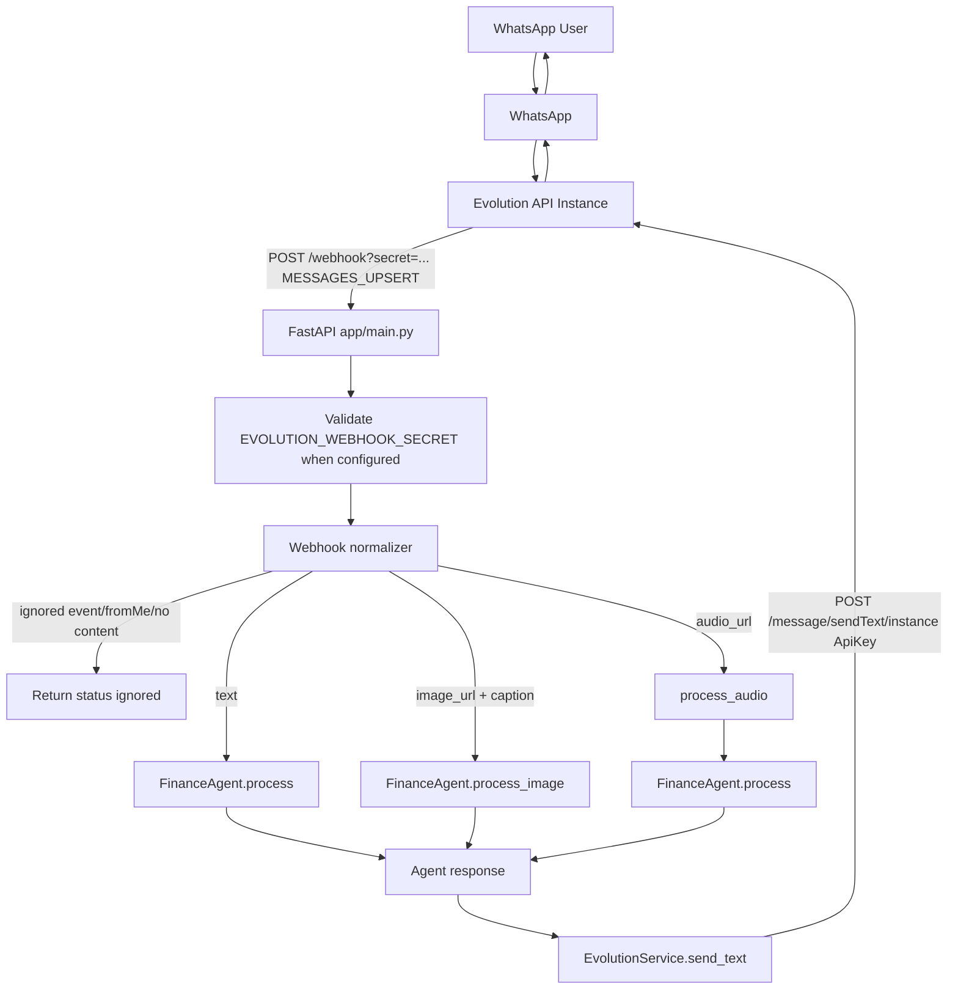

# Technical Design: Migracao da Z-API para Evolution API

## Architectural Overview

The migration will replace the current Z-API gateway with an Evolution API gateway while preserving the internal WhatsApp contract used by the FastAPI webhook flow:

```python
await whatsapp.send_text(phone=phone, message=response)
```

The selected approach is an adapter plus normalizer design. `app/services/evolution.py` will own outbound calls to Evolution API. A new webhook normalizer module will translate Evolution API webhook payloads into a stable internal object before `app/main.py` invokes the existing `FinanceAgent`. This keeps provider-specific payload parsing outside the agent graph and avoids changes to `FinanceAgent`, `AgentState`, or database models.

Two other approaches were considered and rejected:

- Rewriting `FinanceAgent` to consume Evolution payloads directly. This creates unnecessary coupling between business logic and a provider-specific webhook shape.
- Keeping a dual Z-API/Evolution abstraction with runtime provider switching. This adds configuration and test complexity even though the accepted scope explicitly removes parallel operation after migration.

The implementation will therefore make one narrow migration:

- Replace `ZAPIService` import and instance with `EvolutionService`.
- Add an Evolution webhook normalizer before the existing text/image/audio branches.
- Validate an optional webhook secret on `POST /webhook`.
- Update `.env.example`, `README.md`, and tests.

The Evolution API instance lifecycle remains outside this application. The app will not create instances, generate QR codes, pair WhatsApp numbers, or use the Evolution API database.

## Data Flow Diagram



## Component & Interface Definitions

### `app/services/evolution.py`

Defines the outbound WhatsApp provider client. It replaces `app/services/zapi.py` in runtime imports.

```python
class EvolutionService:
    def __init__(
        self,
        api_url: str | None = None,
        api_key: str | None = None,
        instance_name: str | None = None,
        timeout: float = 15.0,
    ) -> None: ...

    async def send_text(self, phone: str, message: str) -> bool: ...
```

Responsibilities:

- Read `EVOLUTION_API_URL`, `EVOLUTION_API_KEY`, and `EVOLUTION_INSTANCE_NAME` by default.
- Normalize `EVOLUTION_API_URL` by removing trailing `/`.
- Normalize outbound phone numbers by removing WhatsApp JID suffixes such as `@s.whatsapp.net` and `@c.us`.
- Send `POST {api_url}/message/sendText/{instance_name}`.
- Use headers:

```python
{
    "ApiKey": EVOLUTION_API_KEY,
    "Content-Type": "application/json",
}
```

- Use payload:

```python
{
    "number": phone_without_jid_suffix,
    "text": message,
}
```

- Return `True` on successful 2xx response.
- Return `False` on HTTP or unexpected errors.
- Log error status/body without logging `ApiKey`.
- Use explicit HTTP timeout.

Configuration validation should happen when `send_text` is called, so tests can instantiate the class with explicit values and the app can fail clearly if an outbound message is attempted without required Evolution settings.

### `app/services/webhook_normalizer.py`

Defines provider-specific parsing for inbound Evolution payloads.

```python
from dataclasses import dataclass

@dataclass(frozen=True)
class NormalizedWebhookMessage:
    phone: str | None
    from_me: bool
    text: str | None
    image_url: str | None
    image_caption: str | None
    audio_url: str | None
    raw_event: str | None
    ignored: bool
    ignore_reason: str | None = None


def normalize_evolution_webhook(payload: dict) -> NormalizedWebhookMessage: ...


def normalize_whatsapp_phone(value: str | None) -> str | None: ...
```

The normalizer will be intentionally tolerant because Evolution payloads vary by version, event configuration, and provider mode.

Parsing rules:

- Event name candidates: `event`, `type`, `data.event`.
- Message container candidates: `data`, then root payload.
- Accept message events only when the normalized event is absent or equals one of:
  - `MESSAGES_UPSERT`
  - `messages.upsert`
- Ignore known non-message events such as `CONNECTION_UPDATE`, `QRCODE_UPDATED`, `MESSAGES_UPDATE`, `MESSAGES_DELETE`, and `SEND_MESSAGE`.
- `from_me` candidates:
  - `fromMe`
  - `key.fromMe`
  - `data.key.fromMe`
- Phone candidates, in order:
  - `data.key.remoteJid`
  - `key.remoteJid`
  - `data.sender`
  - `sender`
  - `data.remoteJid`
  - `remoteJid`
- Text candidates, in order:
  - `data.message.conversation`
  - `message.conversation`
  - `data.message.extendedTextMessage.text`
  - `message.extendedTextMessage.text`
- Image candidates:
  - URL: `message.imageMessage.url`, `data.message.imageMessage.url`, `image.imageUrl`, `image.url`
  - Caption: `message.imageMessage.caption`, `data.message.imageMessage.caption`, `image.caption`
- Audio candidates:
  - URL: `message.audioMessage.url`, `data.message.audioMessage.url`, `audio.audioUrl`, `audio.url`
- Base64 candidates may be detected for logging/future support, but the first migration will not convert base64 media into temporary files.

Ignored results:

- Non-message event: `ignored=True`, `ignore_reason="unsupported_event"`.
- Own message: `ignored=True`, `ignore_reason="from_me"`.
- Missing phone: `ignored=True`, `ignore_reason="missing_phone"`.
- Missing usable content: `ignored=True`, `ignore_reason="missing_content"`.

### `app/main.py`

Modified responsibilities:

- Replace:

```python
from app.services.zapi import ZAPIService
zapi = ZAPIService()
```

with:

```python
from app.services.evolution import EvolutionService
from app.services.webhook_normalizer import normalize_evolution_webhook

whatsapp = EvolutionService()
```

- Remove `ZAPI_CLIENT_TOKEN` usage.
- Add optional webhook secret validation before processing payload.
- Normalize payload immediately after JSON parsing.
- Keep the existing branch structure after normalization:
  - image URL -> `agent.process_image`
  - audio URL -> `process_audio`, then `agent.process`
  - text -> `agent.process`
- Replace all outbound `zapi.send_text(...)` calls with `whatsapp.send_text(...)`.

Internal helper:

```python
def validate_webhook_secret(request: Request) -> None:
    ...
```

Validation behavior:

- If `EVOLUTION_WEBHOOK_SECRET` is unset, allow the request.
- If set, accept `?secret=<value>`.
- Optionally accept a header such as `X-Webhook-Secret` or `X-Evolution-Webhook-Secret` if implemented.
- Reject invalid or missing secret with `HTTPException(status_code=401, detail="Invalid webhook secret")`.

## API Endpoint Definitions

### Modified inbound endpoint: `POST /webhook`

Receives Evolution API webhooks.

#### Request Query

```text
secret=<EVOLUTION_WEBHOOK_SECRET>
```

Required only when `EVOLUTION_WEBHOOK_SECRET` is configured.

#### Request Body: Text Message Example

Evolution may send the message under `data` or at the root. The normalizer must support both.

```json
{
  "event": "MESSAGES_UPSERT",
  "data": {
    "key": {
      "remoteJid": "5541999999999@s.whatsapp.net",
      "fromMe": false,
      "id": "ABC123"
    },
    "message": {
      "conversation": "gastei 45 no ifood"
    },
    "messageType": "conversation"
  }
}
```

#### Success Response: Processed

```json
{
  "status": "ok"
}
```

#### Success Response: Ignored

```json
{
  "status": "ignored"
}
```

The implementation may include a non-sensitive reason for observability:

```json
{
  "status": "ignored",
  "reason": "from_me"
}
```

#### Error Response: Invalid Secret

```json
{
  "detail": "Invalid webhook secret"
}
```

HTTP status: `401`.

#### Error Response: Unexpected Processing Failure

```json
{
  "detail": "<error message>"
}
```

HTTP status: `500`.

If `phone` was successfully normalized before the failure, the app should attempt to send the existing instability message through `EvolutionService.send_text`.

### Outbound Evolution API endpoint: `POST /message/sendText/{instance}`

Called by `EvolutionService`; this is not served by the FastAPI app.

#### Request Headers

```http
ApiKey: <EVOLUTION_API_KEY>
Content-Type: application/json
```

#### Request Body

```json
{
  "number": "5541999999999",
  "text": "Mensagem"
}
```

#### Success Handling

Any 2xx response is treated as success and `send_text` returns `True`.

#### Error Handling

Non-2xx responses and transport exceptions are logged without credentials and `send_text` returns `False`.

### Operational Evolution API endpoint: `POST /webhook/set/{instance}`

This endpoint is configured outside the application. It is documented for deployment operators only.

```json
{
  "enabled": true,
  "url": "https://seu-app.up.railway.app/webhook?secret=<EVOLUTION_WEBHOOK_SECRET>",
  "webhookByEvents": false,
  "webhookBase64": false,
  "events": [
    "MESSAGES_UPSERT",
    "CONNECTION_UPDATE",
    "QRCODE_UPDATED"
  ]
}
```

The app will not call this endpoint during normal runtime.

## Database Schema Changes

No database schema changes are required.

The existing app database remains owned by `DATABASE_URL` and continues to use the current SQLAlchemy models:

- `app/models/user.py`
- `app/models/transaction.py`

No tables from the Evolution API deployment database will be read or written by this application.

## Security Considerations

### API Key Handling

`EVOLUTION_API_KEY` must only be sent to Evolution API in the `ApiKey` header. It must not be included in URLs, JSON payloads, logs, test snapshots, or exception messages.

### Webhook Authentication

`POST /webhook` is public by deployment necessity. When `EVOLUTION_WEBHOOK_SECRET` is configured, the app will reject requests without the expected secret using `401`. Query string support is required because it works with providers that can only configure a URL. Header support is optional and can be added without changing the public endpoint contract.

### Input Validation and Payload Tolerance

The normalizer must treat all webhook fields as optional. Missing or malformed fields should produce an ignored result rather than a server error whenever possible. This prevents non-message operational events from causing error noise or accidental agent execution.

### Sensitive Logging

Logs may include event names, ignore reasons, response status codes, and sanitized phone identifiers when useful. Logs must not include `ApiKey`, webhook secret, raw Authorization-like headers, or complete media/base64 bodies. Full raw payload logging should be avoided or gated because WhatsApp messages can contain personal financial data.

### Media Handling

For the first migration, media is only processed when Evolution API provides a URL compatible with the existing image and audio flows. Base64 media must not be written to disk or passed into the agent until a specific media design is approved.

## Test Strategy

### Unit Tests

Add tests for `app/services/evolution.py`:

- `send_text` posts to `/message/sendText/{instance}`.
- `send_text` sends `ApiKey` and `Content-Type` headers.
- `send_text` maps payload fields to `number` and `text`.
- `send_text` strips JID suffixes before sending.
- `send_text` returns `False` for HTTP errors.

Add tests for `app/services/webhook_normalizer.py`:

- Normalizes `MESSAGES_UPSERT` text from `data.message.conversation`.
- Normalizes text from root `message.conversation`.
- Normalizes text from `message.extendedTextMessage.text`.
- Strips `@s.whatsapp.net` from `remoteJid`.
- Ignores `key.fromMe == true`.
- Ignores non-message events such as `CONNECTION_UPDATE`.
- Ignores missing phone and missing content.
- Extracts image URL/caption when `imageMessage` is present.
- Extracts audio URL when `audioMessage` is present.

### Integration Tests

Add FastAPI tests using `TestClient` or `httpx.AsyncClient`:

- `POST /webhook` with valid text payload calls the agent and then `EvolutionService.send_text`.
- `POST /webhook` with own message returns ignored and does not call the agent.
- `POST /webhook` with unsupported event returns ignored and does not call the agent.
- `POST /webhook` with configured secret rejects missing or wrong secret with `401`.
- `POST /webhook` with configured secret accepts the correct query string secret.

Agent internals should be mocked in webhook integration tests. Existing agent tests remain focused on graph behavior and should not be coupled to Evolution payloads.

### End-to-End Manual Validation

Manual validation will be run against the connected Railway Evolution API instance:

1. Configure app variables: `EVOLUTION_API_URL`, `EVOLUTION_API_KEY`, `EVOLUTION_INSTANCE_NAME`, `EVOLUTION_WEBHOOK_SECRET`, `DATABASE_URL`, and `OPENAI_API_KEY`.
2. Configure Evolution API webhook URL as `https://<app>/webhook?secret=<secret>`.
3. Send a WhatsApp text message to the connected number.
4. Confirm logs show `MESSAGES_UPSERT` and normalized text.
5. Confirm the agent processes the message and replies through Evolution API.
6. Send a message from the connected WhatsApp number and confirm it is ignored.
7. Send image and audio messages, capture sanitized payload shape, and adjust media support only if URLs are available and compatible with the existing flow.

## Implementation Notes

### File Changes

Expected files to add:

- `app/services/evolution.py`
- `app/services/webhook_normalizer.py`
- `tests/test_evolution_service.py`
- `tests/test_webhook_normalizer.py`
- `tests/test_webhook.py`

Expected files to modify:

- `app/main.py`
- `.env.example`
- `README.md`

Expected files to retire from runtime:

- `app/services/zapi.py`

The file may remain temporarily if not imported, but no runtime path should depend on it after migration.

### Environment Variables

Required for Evolution API outbound messaging:

```env
EVOLUTION_API_URL=https://sua-evolution.up.railway.app
EVOLUTION_API_KEY=...
EVOLUTION_INSTANCE_NAME=...
```

Optional webhook protection:

```env
EVOLUTION_WEBHOOK_SECRET=...
```

Still owned by this app:

```env
DATABASE_URL=...
OPENAI_API_KEY=...
```

Not required after migration:

```env
ZAPI_INSTANCE_ID
ZAPI_TOKEN
ZAPI_CLIENT_TOKEN
```

### Compatibility Boundaries

The stable internal normalized object is the boundary between Evolution API and the finance agent. Any future changes caused by real Evolution payloads should be isolated to `webhook_normalizer.py` and its tests unless a new media capability is explicitly introduced.

