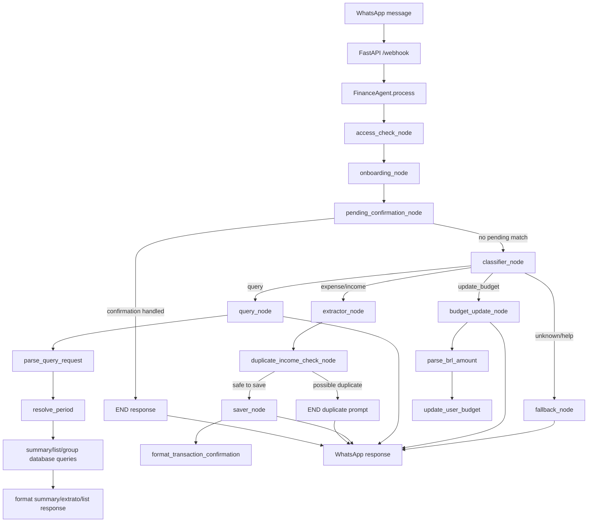

# Technical Design: Orcamento, entradas, saldo e extrato financeiro

## Architectural Overview

The implementation will keep the current FastAPI webhook, Evolution API adapter, `FinanceAgent`, SQLAlchemy models, and LangGraph-based agent flow. The change is concentrated inside the financial agent and database helper layer.

The current graph has a simple route:

```text
access_check -> onboarding -> classifier -> extractor/query/fallback -> saver
```

This design extends that flow with deterministic helpers and three new graph steps:

- `pending_confirmation_node`: resolves a previous duplicate-income confirmation before classifying a new command.
- `duplicate_income_check_node`: pauses a duplicated salary/income registration before saving.
- `budget_update_node`: updates `User.monthly_budget` from explicit budget commands.

The selected approach is hybrid:

- deterministic Python code owns money parsing, calendar periods, budget math, summaries, extrato formatting, duplicate detection, and fixed templates;
- the LLM continues to classify broad intent and extract transaction fields, but prompts become stricter;
- query responses use structured data from database helpers, reducing reliance on the LLM for calculations.

This avoids a broad rewrite of the agent and fixes the core correctness issues where they happen: data selection, period interpretation, and response formatting.

The existing `users.monthly_budget` column remains the source of budget truth. Existing `transactions` remain the source of entries and expenses. A small new table stores pending confirmations for duplicate salary or recurring income entries, because confirmation requires state across WhatsApp messages.

## Data Flow Diagram



## Component & Interface Definitions

### `app/agent/state.py`

Extend the intent set and state with fields used by the new nodes. The project currently uses a plain `str` class for intents; keep that style to minimize churn.

```python
class MessageIntent(str):
    EXPENSE = "expense"
    INCOME = "income"
    QUERY = "query"
    UPDATE_BUDGET = "update_budget"
    UNKNOWN = "unknown"
```

Optional state fields:

```python
class AgentState(BaseModel):
    phone: str
    message: str
    image_url: Optional[str] = None
    intent: Optional[str] = None
    amount: Optional[float] = None
    category: Optional[str] = None
    description: Optional[str] = None
    transaction_type: Optional[TransactionType] = None
    response: Optional[str] = None

    # Query/update helpers
    period_start: Optional[datetime] = None
    period_end: Optional[datetime] = None
    query_kind: Optional[str] = None
```

If datetime fields make test setup noisy, the implementation may keep query metadata local to `query_node`; the graph does not require these fields unless later nodes need them.

### `app/agent/finance_utils.py`

Add a small deterministic utility module for formatting, parsing, periods, and response templates.

```python
from dataclasses import dataclass
from datetime import datetime
from enum import Enum

class QueryKind(str, Enum):
    SUMMARY = "summary"
    EXTRACT = "extract"
    LIST_INCOME = "list_income"
    LIST_EXPENSE = "list_expense"
    CATEGORY_DETAIL = "category_detail"
    INCOME_BY_SOURCE = "income_by_source"
    HELP = "help"

@dataclass(frozen=True)
class Period:
    label: str
    start: datetime
    end: datetime
    is_moving_window: bool = False

@dataclass(frozen=True)
class QueryRequest:
    kind: QueryKind
    period: Period
    transaction_type: TransactionType | None = None
    category: str | None = None
    text_filter: str | None = None
    limit: int = 50
```

Functions:

```python
def fmt_brl(value: float | None) -> str: ...
def parse_brl_amount(text: str) -> float | None: ...
def resolve_period(message: str, now: datetime | None = None) -> Period: ...
def parse_query_request(message: str, now: datetime | None = None) -> QueryRequest: ...
def format_transaction_confirmation(kind: TransactionType, amount: float, category: str, description: str | None) -> str: ...
def format_budget_updated(amount: float) -> str: ...
def format_help() -> str: ...
```

Money parsing rules:

- strip `R$`, spaces, and common punctuation;
- support Brazilian decimal comma and thousands dot;
- support plain dot decimals like `4641.14`;
- support comma decimals like `4641,14`;
- support multiplier expressions like `4 mil`;
- support a small Portuguese number-word map for required examples, including `quatro mil reais`.

This parser must be used by onboarding, budget update, and extractor post-processing. The LLM may still return an amount, but deterministic parsing of the original message should override missing or invalid extracted values when it confidently finds a value.

Period rules:

- `esse mes`, `este mes`, `resumo do mes`: first day of current calendar month through `now`;
- `mes passado`: full previous calendar month;
- named month: full named month; default to current year, unless that month is in the future relative to `now`, in which case use the previous year;
- named month with year: exact month/year;
- `ultimos 30 dias`: `now - 30 days` through `now`.

### `app/agent/prompts.py`

Update prompts without expanding business rules into free-form text generation.

`CLASSIFIER_PROMPT` returns one of:

```text
expense, income, query, update_budget, unknown
```

Classifier examples must explicitly distinguish:

- `meu orcamento e 5000` -> `update_budget`
- `tenho 5000 para gastar` -> `update_budget`
- `alterar orcamento para 5000` -> `update_budget`
- `recebi 5000` -> `income`
- `ganho 5000 por mes` -> `income`
- `gastei 5000` -> `expense`
- `extrato deste mes` -> `query`
- `listar minhas entradas` -> `query`

`QUERY_PROMPT` should be narrowed to style and wording only. It must receive:

- `monthly_budget` as value or explicit missing marker;
- `total_income`;
- `total_expense`;
- `balance`;
- `budget_available`;
- `period_label`;
- filtered transaction details.

It must instruct the model:

- do not infer budget from income;
- budget is `User.monthly_budget`;
- income is received money;
- balance is `income - expense`;
- budget available is `monthly_budget - expense`;
- use zero emojis by default and no more than one.

### `app/agent/nodes.py`

#### `onboarding_node`

Replace the direct `float(...)` conversion with `parse_brl_amount`.

Budget prompt text:

```text
Antes de começar, informe seu orçamento mensal: o valor máximo que você pretende gastar no mês.

Depois, você poderá registrar entradas separadamente, como salário, vale alimentação ou freelances.
```

Invalid budget prompt must include accepted examples:

```text
Exemplos: 3000, 1500.50, 4.641,14, R$ 4.641,14 ou 4 mil.
```

#### `classifier_node`

Allow `update_budget` as a valid return value. Invalid classifier responses continue to become `unknown`.

#### `extractor_node`

Keep LLM JSON extraction, then normalize amount:

```python
parsed_amount = parse_brl_amount(state.message)
amount = parsed_amount if parsed_amount is not None else data.get("amount", 0.0)
```

This prevents onboarding and transaction registration from depending on the LLM for common Brazilian money formats.

#### `duplicate_income_check_node`

Runs after `extractor_node` and before `saver_node`.

Behavior:

- if `state.transaction_type != TransactionType.INCOME`, continue;
- if category/description does not indicate salary or recurring income, continue;
- query same-user income transactions in current calendar month with same amount and matching salary category/description;
- if none exists, continue;
- if duplicate exists, create or replace a pending confirmation row and return a response:

```text
Você já registrou uma entrada de Salário de R$ 4.041,14 neste mês.
Deseja registrar outra mesmo assim? Responda "sim" para registrar ou "não" para cancelar.
```

The node sets `response` when it pauses. A conditional edge routes `response != None` to `END`; otherwise it routes to `saver`.

#### `pending_confirmation_node`

Runs after onboarding and before classifier.

Behavior:

- load active pending confirmation for `state.phone`;
- if none exists, continue;
- if message is affirmative (`sim`, `s`, `yes`, `pode registrar`, `registrar mesmo assim`), save the pending transaction, mark pending as resolved, and return the normal fixed transaction confirmation;
- if message is negative (`nao`, `não`, `n`, `cancelar`), mark pending as cancelled and return:

```text
Registro cancelado.
```

- if message is unrelated, either keep the pending row and continue to classifier, or return a short prompt asking the user to answer yes/no. The recommended implementation is to keep the pending row and continue only for messages that are clearly new financial commands, so the bot does not block normal use.

#### `budget_update_node`

Runs when classifier intent is `update_budget`.

Behavior:

- parse amount from `state.message` with `parse_brl_amount`;
- if missing, return invalid budget prompt;
- call `update_user_budget(state.phone, amount, complete_onboarding=False)`;
- return:

```text
Orçamento atualizado

Novo orçamento mensal: R$ 5.000,00
```

`complete_onboarding=False` is a proposed parameter so normal budget updates do not alter onboarding state.

#### `saver_node`

Keep `save_transaction`, replace free-form emoji response with `format_transaction_confirmation`.

Expense template:

```text
Gasto registrado

Categoria: Alimentação
Valor: R$ 45,00
Descrição: iFood
```

Income template:

```text
Entrada registrada

Categoria: Salário
Valor: R$ 4.041,14
Descrição: salário
```

#### `query_node`

Replace the fixed `get_summary(phone, days=30)` flow with:

1. `user = get_user(state.phone)`
2. `request = parse_query_request(state.message)`
3. database helpers using `request.period.start` and `request.period.end`
4. deterministic totals:
   - `total_income`
   - `total_expense`
   - `balance = total_income - total_expense`
   - `budget_available = user.monthly_budget - total_expense` when budget exists
5. deterministic formatting for common query kinds:
   - summary
   - extract
   - list income
   - list expense
   - category detail
   - income by source
6. optional LLM wording only when the query does not match a deterministic formatter.

The default "month" behavior is calendar month, not last 30 days.

#### `fallback_node`

Replace the current emoji-heavy help with `format_help()`.

### `app/agent/graph.py`

Updated graph:

```python
graph.add_node("pending_confirmation", pending_confirmation_node)
graph.add_node("classifier", classifier_node)
graph.add_node("extractor", extractor_node)
graph.add_node("duplicate_income_check", duplicate_income_check_node)
graph.add_node("budget_update", budget_update_node)
graph.add_node("query", query_node)
graph.add_node("fallback", fallback_node)
graph.add_node("saver", saver_node)

access_check -> onboarding
onboarding -> pending_confirmation
pending_confirmation -> END when response exists
pending_confirmation -> classifier otherwise
classifier -> extractor | query | budget_update | fallback
extractor -> duplicate_income_check
duplicate_income_check -> END when response exists
duplicate_income_check -> saver otherwise
saver/query/budget_update/fallback -> END
```

Route helpers:

```python
def route_pending_confirmation(state: AgentState) -> str:
    return "end" if state.response is not None else "classifier"

def route_after_classifier(state: AgentState) -> str:
    if state.intent in ("expense", "income"):
        return "extractor"
    if state.intent == "query":
        return "query"
    if state.intent == "update_budget":
        return "budget_update"
    return "fallback"

def route_after_duplicate_check(state: AgentState) -> str:
    return "end" if state.response is not None else "saver"
```

### `app/services/database.py`

Add date-range query helpers. Keep existing functions for compatibility; update `get_summary(days=30)` only if tests require the old contract to remain.

```python
def update_user_budget(phone: str, budget: float, complete_onboarding: bool = True) -> User: ...

def get_transactions(
    phone: str,
    start_date: datetime | None = None,
    end_date: datetime | None = None,
    transaction_type: TransactionType | None = None,
    category: str | None = None,
    text_filter: str | None = None,
    limit: int | None = None,
) -> list[Transaction]: ...

def get_summary_for_period(phone: str, start_date: datetime, end_date: datetime) -> dict: ...

def get_expenses_by_category_for_period(phone: str, start_date: datetime, end_date: datetime) -> dict[str, float]: ...

def find_possible_duplicate_income(phone: str, amount: float, start_date: datetime, end_date: datetime, category: str, description: str | None) -> Transaction | None: ...
```

Pending confirmation helpers:

```python
def create_pending_confirmation(phone: str, action_type: str, payload: dict, expires_at: datetime) -> PendingConfirmation: ...
def get_active_pending_confirmation(phone: str, action_type: str | None = None) -> PendingConfirmation | None: ...
def resolve_pending_confirmation(pending_id: int, status: str) -> None: ...
```

### `app/models/pending_confirmation.py`

Add a new model to persist confirmation state across messages.

```python
class PendingConfirmation(Base):
    __tablename__ = "pending_confirmations"

    id = Column(Integer, primary_key=True, autoincrement=True)
    phone = Column(String, nullable=False, index=True)
    action_type = Column(String, nullable=False, index=True)
    payload_json = Column(Text, nullable=False)
    status = Column(String, nullable=False, default="pending")
    created_at = Column(DateTime, default=datetime.utcnow)
    expires_at = Column(DateTime, nullable=False)
    resolved_at = Column(DateTime, nullable=True)
```

Payload for duplicate income:

```json
{
  "transaction_type": "income",
  "amount": 4041.14,
  "category": "Salário",
  "description": "salário"
}
```

`app/services/database.py` must import this model before `Base.metadata.create_all(bind=engine)` so the table is created.

## API Endpoint Definitions

No new public HTTP endpoint is required.

### Existing endpoint: `POST /webhook`

The endpoint contract remains unchanged. It still receives Evolution API webhook payloads, normalizes them, calls `FinanceAgent`, and sends the returned response to WhatsApp.

#### Behavior Changes

- A message such as `alterar meu orçamento para 5000` now returns a budget update confirmation instead of creating an income.
- A duplicate salary registration may return a confirmation prompt and defer database insertion until the user confirms.
- Query responses now use calendar-month periods by default.
- Help/fallback responses use the expanded command list and professional tone.

#### Success Response

```json
{
  "status": "ok"
}
```

#### Ignored Response

Existing ignored responses remain unchanged for webhook-level filtering:

```json
{
  "status": "ignored",
  "reason": "private_chat"
}
```

#### Error Response

Existing FastAPI error behavior remains unchanged:

```json
{
  "detail": "error message"
}
```

## Database Schema Changes

Existing tables:

- `users.monthly_budget` remains the budget source.
- `transactions.type` continues to distinguish `income` and `expense`.
- `transactions.created_at` is used for calendar-period queries.

New table:

```sql
CREATE TABLE pending_confirmations (
    id INTEGER PRIMARY KEY AUTOINCREMENT,
    phone VARCHAR NOT NULL,
    action_type VARCHAR NOT NULL,
    payload_json TEXT NOT NULL,
    status VARCHAR NOT NULL DEFAULT 'pending',
    created_at DATETIME,
    expires_at DATETIME NOT NULL,
    resolved_at DATETIME
);

CREATE INDEX ix_pending_confirmations_phone ON pending_confirmations (phone);
CREATE INDEX ix_pending_confirmations_action_type ON pending_confirmations (action_type);
```

SQLite and PostgreSQL compatibility:

- SQLAlchemy should define the table through ORM to preserve compatibility with the current `Base.metadata.create_all` flow.
- SQLite uses `INTEGER PRIMARY KEY AUTOINCREMENT`; PostgreSQL will map SQLAlchemy integer primary key to its native autoincrement behavior.
- No migration tool is currently present. New-table creation works with `create_all`; altering existing columns should be avoided in this feature.

No existing column alteration is required.

## Security Considerations

- Financial actions remain scoped by `phone`, which is already derived from the normalized WhatsApp participant identity in the current webhook design.
- Budget updates must only happen after the same access and onboarding checks already applied to normal messages.
- The money parser must reject ambiguous or missing values instead of defaulting to zero for budget updates.
- Duplicate confirmation rows must be scoped by `phone`; one user's `sim` must never resolve another user's pending action.
- Pending confirmations should expire, with a recommended TTL of 30 minutes, to avoid saving stale transactions after unrelated later replies.
- Logs should avoid full raw messages when they include financial amounts. Existing logs may need to be toned down if they print full user text in production.
- LLM prompts must explicitly forbid inventing budget values. Deterministic Python totals should be preferred for financial calculations.
- The new table stores financial action payloads; it should not store API keys, webhook secrets, media URLs, or raw webhook payloads.

## Test Strategy

### Unit Tests

Add focused tests for `app/agent/finance_utils.py`:

- `parse_brl_amount("4641.14") == 4641.14`
- `parse_brl_amount("4.641,14") == 4641.14`
- `parse_brl_amount("R$ 4.641,14") == 4641.14`
- `parse_brl_amount("4641,14") == 4641.14`
- `parse_brl_amount("4 mil") == 4000.0`
- `parse_brl_amount("quatro mil reais") == 4000.0`
- `resolve_period("esse mes")` returns first day of current month through now.
- `resolve_period("mes passado")` returns previous calendar month.
- `resolve_period("ultimos 30 dias")` returns a moving 30-day window.
- transaction confirmation templates match the approved fixed format.
- help text contains gasto, entrada, resumo, extrato, alterar orçamento and categoria examples.

### Agent Node Tests

Extend `tests/test_agent.py`:

- classifier accepts `update_budget`;
- `budget_update_node` calls `update_user_budget` and does not call `save_transaction`;
- onboarding budget parsing accepts Brazilian formats;
- `saver_node` returns exact fixed templates for expense and income;
- `duplicate_income_check_node` creates pending confirmation and does not save immediately;
- `pending_confirmation_node` saves pending transaction on affirmative response;
- `pending_confirmation_node` cancels pending transaction on negative response.

Existing test expectation `Entrada registrado` should be corrected to `Entrada registrada`.

### Database Tests

Add tests for `app/services/database.py`:

- `get_summary_for_period` separates income, expense, balance, and category totals;
- date-range filters include transactions inside the interval and exclude outside transactions;
- type filters return only income or only expense;
- category filter is case-insensitive;
- duplicate salary lookup finds same amount/category in the same calendar month;
- pending confirmation lifecycle creates, reads, resolves, and excludes expired rows.

### Query Tests

Add tests for deterministic query behavior, preferably by patching LLM calls:

- summary with `monthly_budget=4641.14`, income `4641.14`, expense `820.00` returns budget, income, expense, balance `3821.14`, and budget available `3821.14`;
- "listar minhas entradas" lists only income;
- "listar meus gastos" lists only expenses;
- "quanto recebi de salário?" filters salary income;
- "quanto gastei com alimentação este mês?" filters Alimentação expenses in current calendar month;
- "extrato deste mês" separates Entradas, Gastos, and Resumo.

### Integration Tests

Use the existing FastAPI webhook test style:

- budget update message through `/webhook` produces a WhatsApp response and updates the user budget;
- duplicate salary message through `/webhook` produces a confirmation prompt without saving;
- affirmative response through `/webhook` saves the pending income;
- query through `/webhook` uses calendar month rather than last 30 days.

### E2E/Manual Validation

Manual WhatsApp validation should cover:

- onboarding with `R$ 4.641,14`;
- registering salary and a gasto;
- summary of current month showing budget, entries, gastos, saldo, and budget remaining separately;
- extrato of current month;
- budget update command;
- duplicate salary confirmation.

## Implementation Notes

- Keep response strings ASCII-compatible where possible, but preserve Portuguese accents if the existing file already uses them. The current codebase already contains Portuguese text with accents.
- Prefer deterministic formatting for user-facing financial numbers. Do not ask the LLM to calculate currency totals.
- Do not add a migration framework as part of this feature. A new SQLAlchemy model/table is enough for the pending confirmation requirement.
- Keep existing public `FinanceAgent.process(phone, message)` and `FinanceAgent.process_image(phone, image_url, caption)` signatures.
- Keep webhook behavior unchanged except for the content of agent responses.
